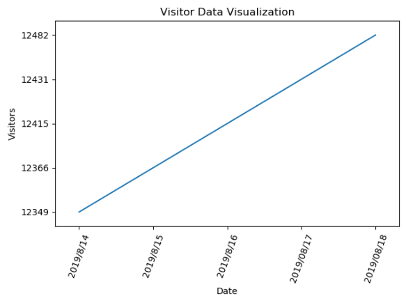
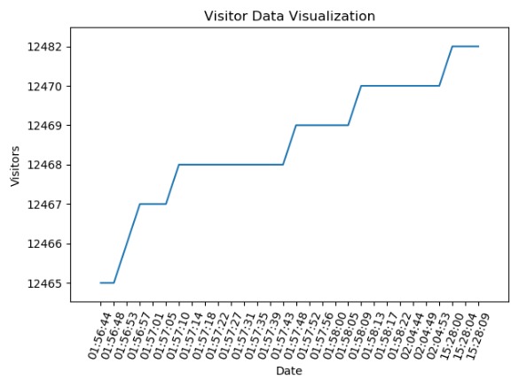

## CSDN-Visitor_Monitor是什么?

一个csdn访客量监视器

## CSDN-Visitor_Monitor有哪些功能？
* 爬虫功能
    *  将所有的访客数据爬取下来并统计
* 可视化接口
	*  以日期作为x轴
	*  
	*  以时间作为x轴
	*  
	
## 有问题反馈
在使用中有任何问题，欢迎反馈给我，可以用以下联系方式跟我交流

* 邮件(kiesbayi@gmail.com)
* QQ: 1290017556
* WeChat: thf056
* csdn: [@小汤六六](https://blog.csdn.net/qq_19381989)

## 捐助开发者
在兴趣的驱动下,写一个`免费`的东西，有欣喜，也还有汗水，希望你喜欢我的作品，同时也能支持一下。

## 文件

* csdn_read_save.py 用于bat脚本运行，专门一天一天采集
* show_csdn_date.py 通过matplotlib展示每天的变化
* to_get_csdn_visitor.py 添加了更新检验模块(保存时间数据的唯一)
* ./Read_msg/read_msg.csv存放日数据 ./Test_msg/test_msg.csv存放测试时的数据（以秒为单位）
* ./Visitor/slum_csdn.py 用于测试时的机器人访客
* ./Detail
	*  csdn_test.py 添加了每篇文章的访客量日变化和总变化
	*  ./Read_msg 存放数据
